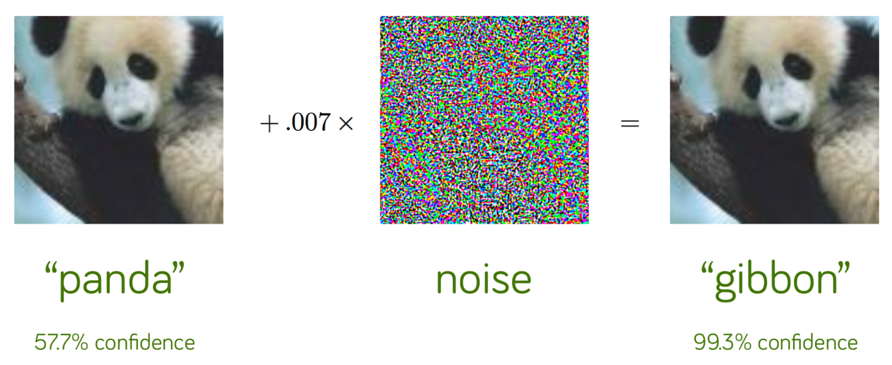
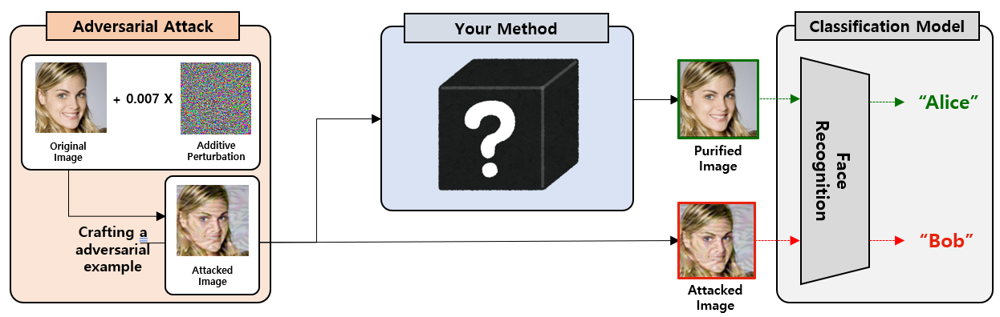
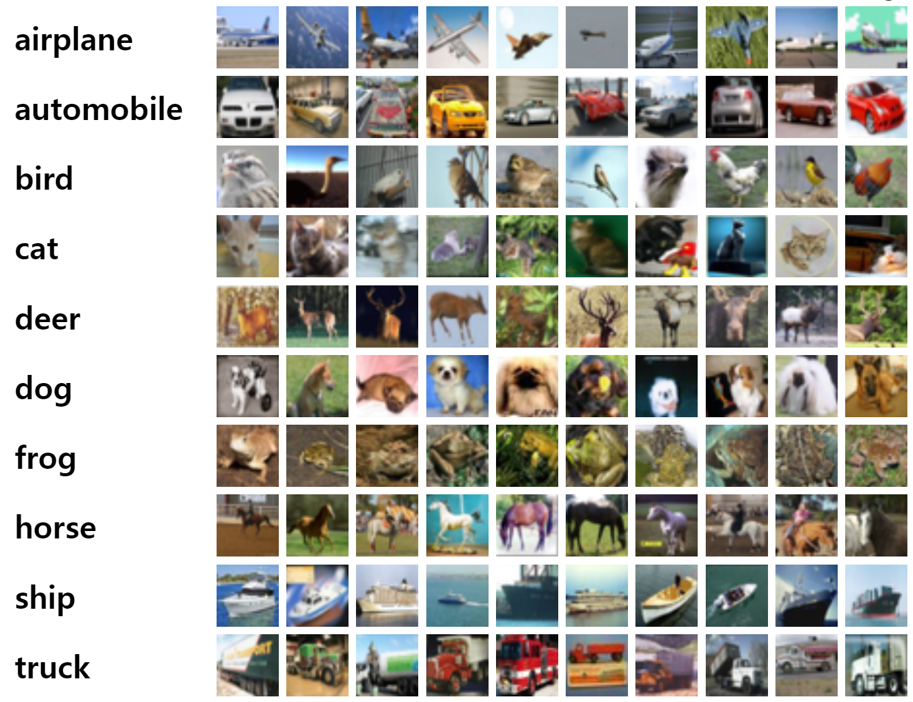

## Project title

Improve model robustness and uncertainty to defend against adversarial attacks.

## Project introduction

### **Motivation**

<center>


<p> Figure 1. Example of adversarial attack </p>

</center>

Adversarial attacks that create input values (adversarial examples) that intentionally lead to misclassification by using noise (perturbation) values created by exploiting the internal vulnerabilities of the deep learning model can reduce the accuracy and performance of the model.

Here are some reasons why you should consider an adversarial attack:

- To defend against an adversary who will attack the system
- To test the worst-case robustness of machine learning algorithms
- To meaure progress of machine learning algorithms towards human-level abillities

### **Objective**

<center>


<p> Figure 2. Example of preprocessing method </p>

</center>

These adversarial attacks make it more important to remove uncertainty and make the model robust.
Defense methods to counter adversarial attacks are largely divided into adversarial training and pre-processing methods. In this proposal, it does not matter which method is used.

**Developing a method with high standard accuracy and robust accuracy to counter adversarial attacks.**


## Dataset description

The dataset used in this proposal is the CIFAR-10. (https://www.cs.toronto.edu/~kriz/cifar.html)

The CIFAR-10 dataset consists of 60000 32x32 colour images in 10 classes, with 6000 images per class.  

The dataset is divided into five training batches and one test batch, each with 10000 images. The test batch contains exactly 1000 randomly-selected images from each class. The training batches contain the remaining images in random order, but some training batches may contain more images from one class than another. Between them, the training batches contain exactly 5000 images from each class.  

Here are the classes in the dataset, as well as 10 random images from each:

<center>


<p> Figure 3. The CIFAR-10 datasets </p>

</center>

The classes are completely mutually exclusive. There is no overlap between automobiles and trucks. "Automobile" includes sedans, SUVs, things of that sort. "Truck" includes only big trucks. Neither includes pickup trucks.

### **Dataset structure**

There are 50,000 training images (including 10,000 validation images) and 10,000 test images.

```
datasets/cifar-10-batches-py/
|-- batches.meta
|-- data_batch_1
|-- data_batch_2
|-- data_batch_3
|-- data_batch_4
|-- data_batch_5
|-- readme.html
`-- val_batch

0 directories, 8 files
```

### **How to load dataset**

The function used to open the file:

```python
def unpickle(file):
    import pickle
    with open(file, 'rb') as fo:
        dict = pickle.load(fo, encoding='bytes')
    return dict
```

Example of how to read the file:

```python
metadata_path = './cifar-10/batches.meta'
metadata = unpickle(metadata_path)
```

You can use the [load_datasets.py](load_datasets.py) file to see how to separate datasets:

```bash
$ python load_datasets.py

Training data:  (40000, 3, 32, 32)
Training filenames:  (40000,)
Training labels:  (40000,)
Validation data:  (10000, 3, 32, 32)
Validation filenames:  (10000,)
Validation labels:  (10000,)
Test data:  (10000, 3, 32, 32)
Test filenames:  (10000,)
Test labels:  (10000,)
Label names:  (10,)
```

## Baseline: Adversarial Training

When trained for 10 epochs with adversarial examples generated by PGD using the ResNet18 model, standard accuracy (64.41) and robust accuracy (40.47) were obtained.  
I use this as the baseline for my proposal.

10~200 epoch test results:
- 10 epoch: standard accuracy (64.41), robust accuracy (40.47)
- 50 epoch: standard accuracy (76.24), robust accuracy (47.87)
- 200 epoch: standard accuracy (83.68), robust accuracy (44.9)

My baseline code is [adv_training.py](adv_training.py) and the results are as follows:
```bash
$ python adv_training.py 50
Files already downloaded and verified
Files already downloaded and verified
Start Adversarial Training!!!

[ Train epoch: 0 ]

Current batch: 0
Current adversarial train accuracy: 0.0
Current adversarial train loss: 4.730312824249268

Current batch: 10
Current adversarial train accuracy: 0.0625
Current adversarial train loss: 3.628080368041992

Current batch: 20
Current adversarial train accuracy: 0.140625
Current adversarial train loss: 2.8630855083465576

...

Current batch: 90
Current standard accuracy: 0.73
Current standard loss: 0.7156545519828796
Current robust accuracy: 0.48
Current robust loss: 1.364884614944458

Total standard accuarcy: 76.24 %
Total robust Accuarcy: 47.87 %
Total standard loss: 74.34984785318375
Total robust loss: 139.50434005260468
Model Saved: checkpoint/adversarial_training_50.pt

Total training time (50 epoch): 3324.768561 sec

$ file epoch_50.log
logs/epoch_50.log: ASCII text

$ file checkpoint/adversarial_training_50.pt
checkpoint/adversarial_training_50.pt: Zip archive data
```

## QnA
Please leave your questions in the GitHub issues, and refer to the presentation for email. (https://github.com/Jonghyun-An/NN_proposal/issues)
